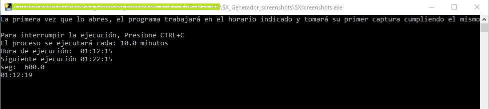
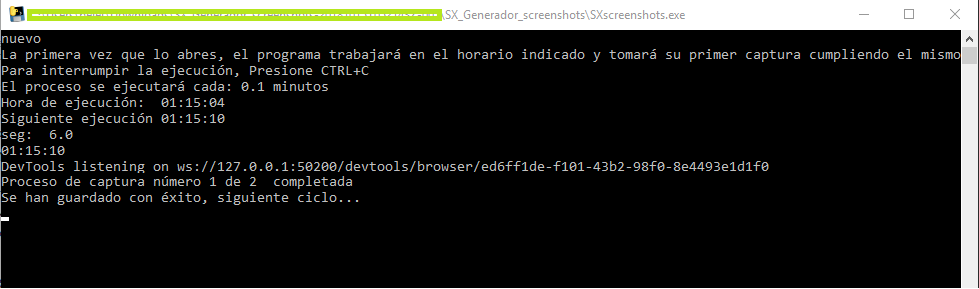
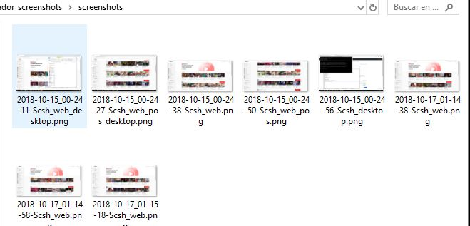
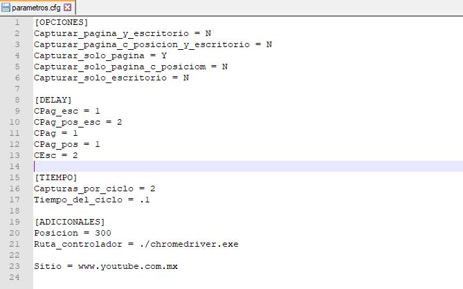

# SX_auto_screencapture

Programa en Python que permite la automatización de captura de pantalla. Con 5 diferentes maneras de captura, diseñado para entornos windows.

El repositorio cuenta con la versión de código libre "SX_Capture_screen" y empaquetado para uso en windows "SX_Generador_screenshots_empaquetado".

<b>Requerimientos para editar / mejorar código</b>

* Python v3
* Google Chrome
* Selenium Chromedriver
* Módulos adicionales python: Configparser, Selenium, Pyautogui

<b>Requerimientos para usar el ejecutable</b>

* Google Chrome
* Selenium chromedriver (incluído)
* Parametros del archivo config (incluído)

<b>Funciones e instrucciones:</b>

Una vez empaquetado el código (o descargandolo así), debes editar el fichero de configuración e ingresar los parámetros necesarios para automatizar tus capturas de pantalla en el fichero "parametros.cfg". El contenido del archivo es el siguiente:

OPCIONES. Te pide indicar que acción o acciones necesitas automatizar. 

1. Capturar pantalla de una página web con tu escritorio
2. Capturar pantalla con una página web en una posición específica del scroll vertical con tu escritorio
3. Capturar solo la imagen de un sitio web
4. Capturar solo la imagen de un sitio web con una posición específica del scroll vertical de tu escritorio
5. Captura de pantalla completa (con lo que se tenga abierto en el escritorio)

DELAY. Permite indicar el tiempo de espera entre una y otra captura de pantalla en caso de necesitar más de una imagen o más de un tipo de captura de pantalla. Se encuentran en el mismo orden que las opciones de captura de pantalla con relación a éstas.

TIEMPO. Permite indicar cuantas capturas de pantalla necesitaremos en cada ciclo y la duración del mismo (cada cuanto tiempo va a ejecutar las acciones automatizadas).

ADICIONALES. Te permite decidir la posición en px que tendrá que moverse el scroll verticalmente en caso de necesitar este tipo de captura de pantalla, la ubicación del controlador (por defecto esta en el mismo directorio) y el sitio web que necesitas capturar en caso de ser necesario este tipo de captura de pantalla.

Descargar Python 3.7 (sugerido):

https://www.python.org/downloads/release/python-371/

Descargar Chromedriver Versión 2.43:

https://chromedriver.storage.googleapis.com/index.html?path=2.43/

<h3><b>Capturas de pantalla:</b></h3>

<b>Ventana de ejecución del programa:</b>

<b>Carpeta con las capturas generadas:</b>

<b>Archivo de configuración:</b>

<b>Captura página y escritorio:</b>

<b>Captura página con posición de scroll y escritorio:</b>

<b>Captura página solamente:</b>

<b>Captura página con posición de scroll solamente:</b>

<b>Captura de pantalla (normal-solo escritorio):</b>

<b>Video de muestra:</b>

Nota: Se ha compilado el ejecutable con binarios de 32 bits, para hacerlo compatible con cualquier arquitectura.

